# Enumeración 🔍

Empezamos listando los servicios que tenemos en los puertos realizamos primero una busqueda rapida para ver que puertos tenemos abiertos en la maquina:

Podemos descubrir los siguientes puertos abiertos:

21,22,80,111

Haciendo una busqueda a los servicios y versiones que tenemos dentro de la maquina podemos encontrar los siguientes datos:

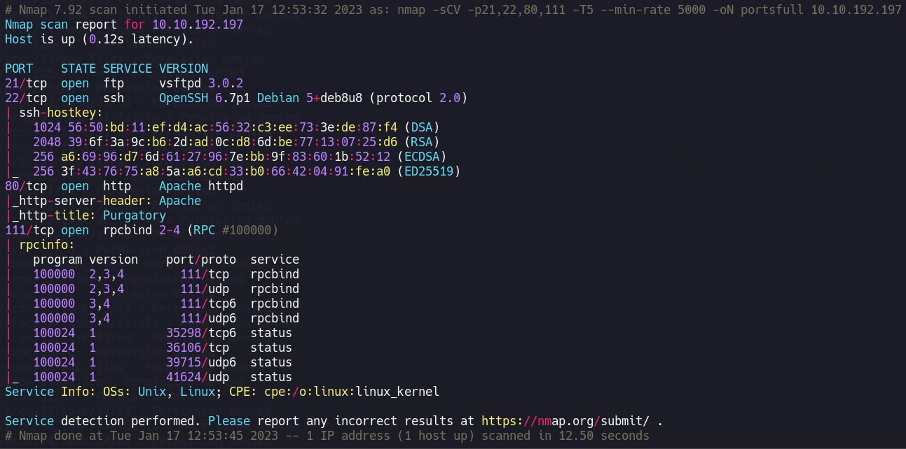

# Acceso a la maquina victima 🗝️

Empezamos accediendo a la pagina web que tiene la maquina a través del navegador.

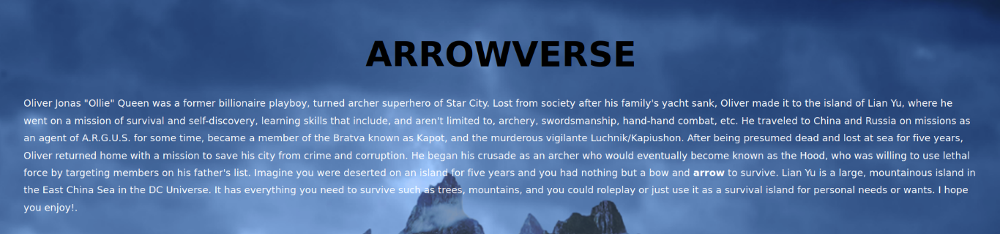

Nos encontramos con un index basico por lo que vamos a listar los directorios de la web para ver si tenemos alguna otra via. Realizando la busqueda con gobuster encontramos un directorio al cual podemos acceder.

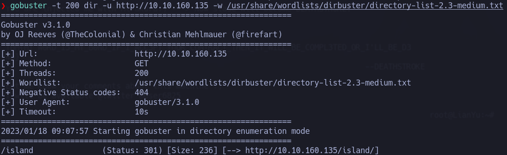

Dentro de esta encontramos lo que parece un usuario llamado vigilante, podemos seguir haciendo directory listing para ver si podemos seguir encontrando nuevas webs accesibles.

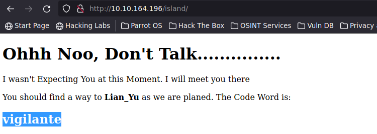

Como vemos podemos acceder a otra mas llamada 2100.

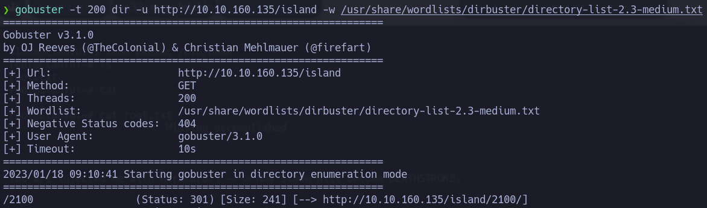

Dentro de esta veremos un enlace a YouTube roto, si inspeccionamos el código fuente de la maquina encontraremos un mensaje que nos avisara de que podemos aprovechar el ticket de alguna forma, pero la página es estática, es por eso que, podemos probar a seguir listando añadiendo la extensión .ticket.

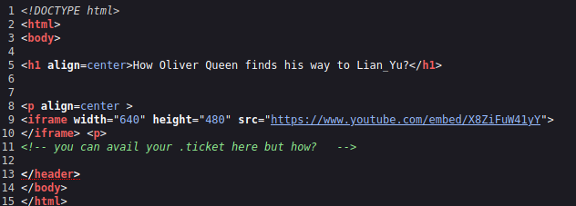

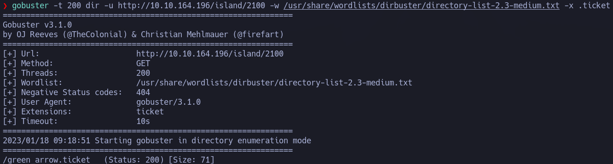

Como vemos conseguimos encontrar un resultado con green_arrow.ticket y una vez dentro conseguimos un codigo el cual podemos intentar tratar para conseguir información.

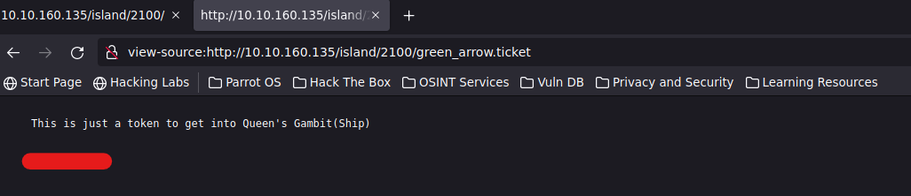

Podemos usar cyberchef para tratar los datos adquiridos y ver si podemos conseguir información útil.

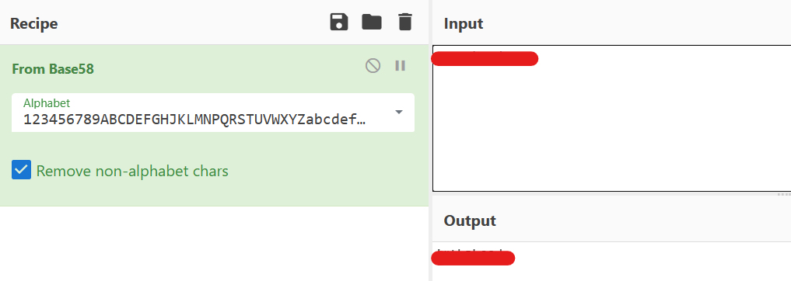

Teniendo el usuario vigilante y lo que parece una contraseña podemos intentar acceder a los servicios expuestos de la maquina pudiendo acceder al ftp gracias a esto y descargar diferentes archivos.

podemos probar a realizar desplazamiento dentro de los directorios del FTP para conseguir mas información gracias a esto conseguimos el nombre de otro usuario.

## Analisis de ficheros

Una vez descargados los ficheros podemos ver que no se pueden abrir las imagenes, podemos comprobar con un editor hexadecimal si los ficheros han sido modificados.

Vemos que la imagen Leave_Me_alone.png tiene una cabecera que no corresponde con los archivos png por lo que vamos a modificarla para ver si podemos acceder a esta.

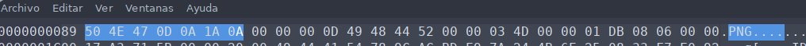

Una vez modificados podemos abrir el archivo sin problemas.

### Esteganografía

Una vez hemos conseguido esta contraseña podemos probarla en el resto de documentos, como vemos la imagen aa.jpg tampoco es accesible es por ello que puede ser que contenga alguna información que no podemos observar a priori. Con steghide y usando la contraseña que nos aparecia en la imagen podemos ver si conseguimos algun fichero nuevo.

Una vez descomprimimos los archivos podemos ver la siguiente información, dentro del fichero shado se nos da lo que parece una contraseña por lo que podemos probarla con el usuario encontrado anteriormente cuando retrocedimos en los directorios del servidor FTP.

Con esto conseguimos finalmente acceso a la maquina y la flag.

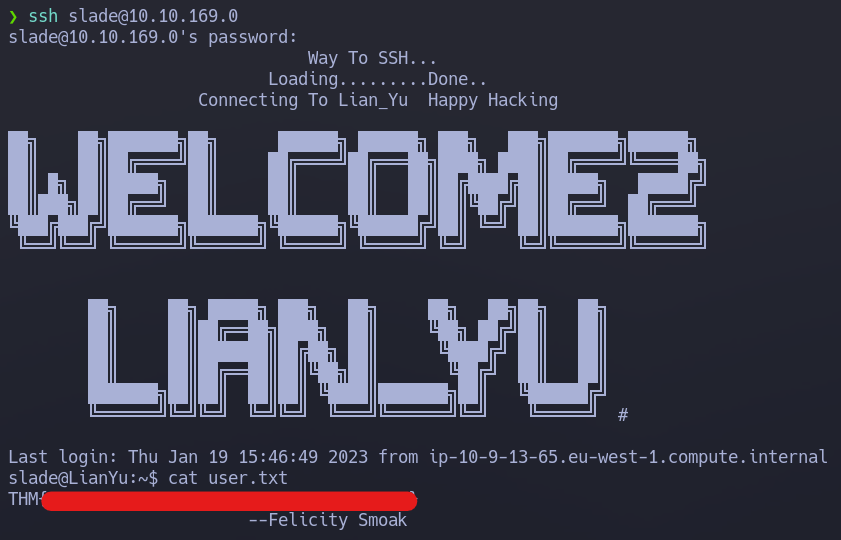

# Escalada de privilegios 🚀

Una vez dentro de la maquina lo primero que haremos será comprobar si el usuario tiene la posibilidad de ejecutar algún binario con sudo el cual sea vulnerable.

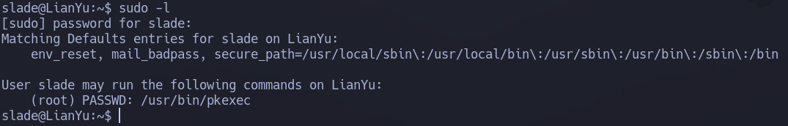

Investigando en el man de la app podemos ver que podemos ejecutar comandos como otro usuario, esto combinado con el permiso de sudo nos permite ejecutar una shell como root.

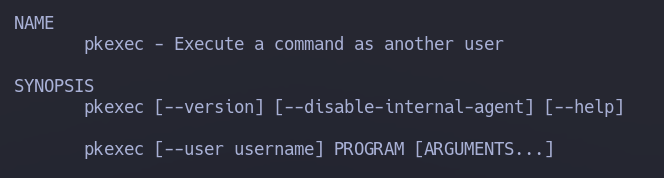

Aqui vemos el comando en cuestion que tenemos que ejecutar:

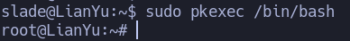

Una vez hemos accedido como root simplemente vamos a su directorio y tendremos acceso a la flag.

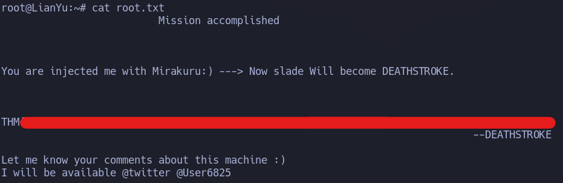